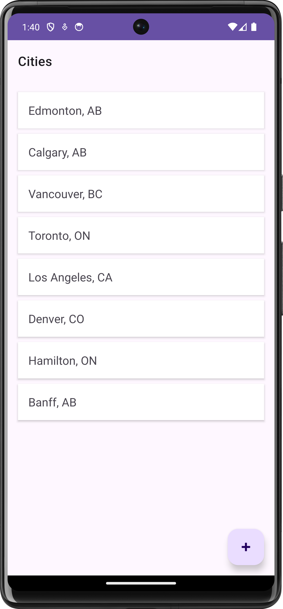
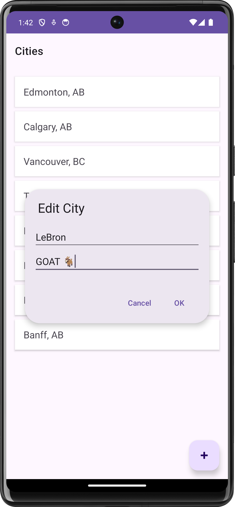
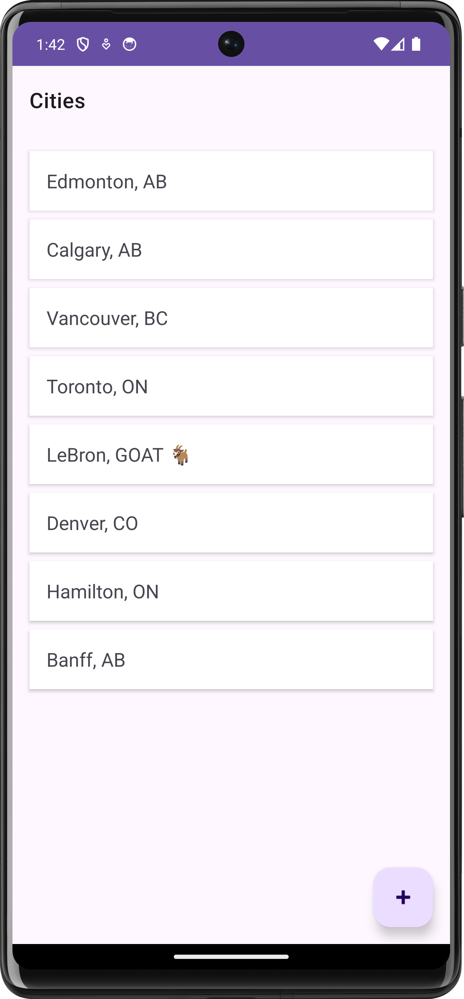

# Lab 3: More Android - Adapters & Fragments [](https://i.imgur.com/GjOB7DB.png)

## 1. Getting Started

1. Clone this repository and open the `/code` folder in Android Studio.
2. You'll find a basic `ListyCity` app that displays a static list of cities.

## 2. Demo Instructions

During the lab demo, we'll implement "Add City" functionality:

1. Review [Lab 3 Slides](https://ualberta-cmput301.github.io/labs/slides/Lab_3_Slides_Winter_2023.pdf)
2. Follow along with [Lab 3 Instructions](https://ualberta-cmput301.github.io/labs/slides/Lab_3_Instructions_Winter_2023.pdf)
3. Read about Java Code Conventions (see the [Code Conventions (Schoepp) PDF](https://ualberta-cmput301.github.io/labs/slides/Code_Conventions_Schoepp.pdf)).
4. By the end, you'll have implemented the ability to add new cities to the list.

## 3. Lab 3 Participation Exercise

### Task

- Add functionality to `ListyCity` to allow **editing** existing cities. The design implementation is flexible and up to your creativity.
- Update the `README.md` and the `LICENSE.md` with your details.

### Example Implementation

<div style="display: flex; flex-wrap: wrap; justify-content: center;">
    
    
</div>
<div style="display: flex; flex-wrap: wrap; justify-content: center;">
    
    
</div>

<br>

> **Note:** Your app does not need to look exactly like the screenshots.  The only requirement is the ability to edit an existing city.  

## 4. Implementation Tips

### 1. City Class Updates

- Add setter methods for city properties
- Example: `setName()`, `setProvince()`

### 2. Choose Your Implementation

Option 1 - Basic Approach:

- Create Fragment constructor with `City` parameter
- Store `City` as Fragment instance variable
- Include empty constructor for new additions

Option 2 - Recommended Approach:

- Implement `newInstance()` pattern
- Use Fragment Bundle for data
- Make `City` implement `Serializable`
- Access data via `getArguments()` or `requireArguments()`

#### Example Code

```java
public static EditFragment newInstance(City city) {
   Bundle args = new Bundle();
   args.putSerializable("city", city);
   EditFragment fragment = new EditFragment();
   fragment.setArguments(args);
   return fragment;
}
```

## 5. Submission

> [!CAUTION]
> Make sure to commit **and** push your code to the GitHub repository before the deadline!
> 
> Once you completed, please go to [Canvas](https://canvas.ualberta.ca/) and submit **your Lab 3 GitHub repository link**.
